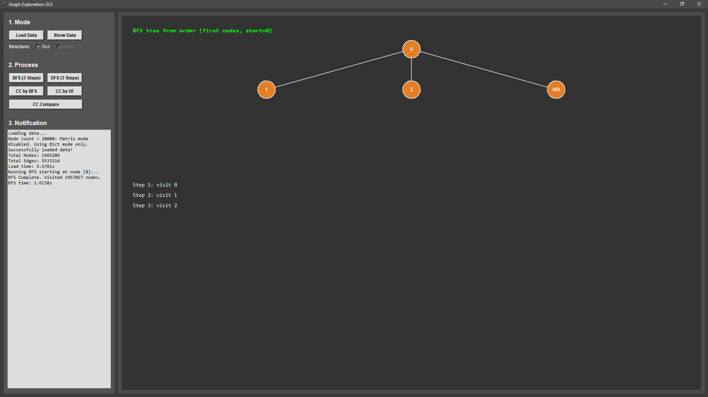

# Undirected Graph Exploration

An educational project to explore:
- Undirected graph data structures
- Graph traversal (BFS, DFS)
- Connected component counting (BFS-based and Union-Find)
- Simple interactive visualization with a Tkinter GUI

<center></center>

## 1) Project Overview

The project loads graph data from text files (roadNet-like format), builds one or more graph structures, and lets you:
- Preview data as matrix or dictionary style
- Visualize early traversal steps
- Compare connected component algorithms and runtime

Current focus is learning/experimentation rather than production optimization.

## 2) Features

- **Graph structures**
	- Adjacency Dictionary
	- Adjacency Matrix
	- Automatic mode rule: if nodes > 20000, dictionary mode only

- **Algorithms**
	- BFS traversal
	- DFS traversal
	- Connected Components by BFS
	- Connected Components by Union-Find (Disjoint Set)
	- CC comparison mode (both algorithms + timing)

- **GUI**
	- Load data button
	- Data preview visualization
	- BFS/DFS visualization
	- Separate CC buttons (BFS, Union-Find, Compare)
	- Console logs for node/edge counts and timing

## 3) Input Format

Expected text format (roadNet-style header):
1. First line: ignored
2. Second line: ignored
3. Third line: `Nodes: <N> Edges: <M>`
4. Fourth line: ignored
5. Remaining lines: one edge per line, e.g. `u v`

Example:

```
# comment
# comment
Nodes: 4 Edges: 3
# from to
0 1
1 2
2 3
```

## 4) Project Structure

```
Undirected_graph_exploration/
├─ algorithm/
│  ├─ traverse.py          # BFS, DFS
│  └─ countcc.py           # CC (BFS + Union-Find)
├─ struct/
│  ├─ structure.py         # Graph structures
│  └─ union_find.py        # Union-Find class
├─ gui/
│  └─ GUI.py               # Tkinter GUI app
├─ dataset/
│  └─ roadNet-CA.txt
└─ README.md
```

## 5) Quick Start

### Requirements
- Python 3.9+ (or newer)

### Run GUI

From project root:

```bash
python main.py
```

### Suggested workflow
1. Click **Load Data** and select a dataset file
2. Choose structure mode (Dict/Matrix) when available
3. Click **Show Data** to preview structure
4. Run **BFS (3 Steps)** or **DFS (3 Steps)**
5. Use **CC by BFS**, **CC by UF**, or **CC Compare**

## 6) Algorithms Summary

- **BFS**
	- Queue-based traversal
	- Good for shortest path in unweighted graphs

- **DFS**
	- Stack-based traversal
	- Good for deep exploration and connectivity checks

- **Connected Components (BFS)**
	- Repeated BFS from unvisited nodes

- **Connected Components (Union-Find)**
	- Merge endpoints of each edge
	- Number of disjoint sets = number of components

## 7) Footnote

<center></center>

